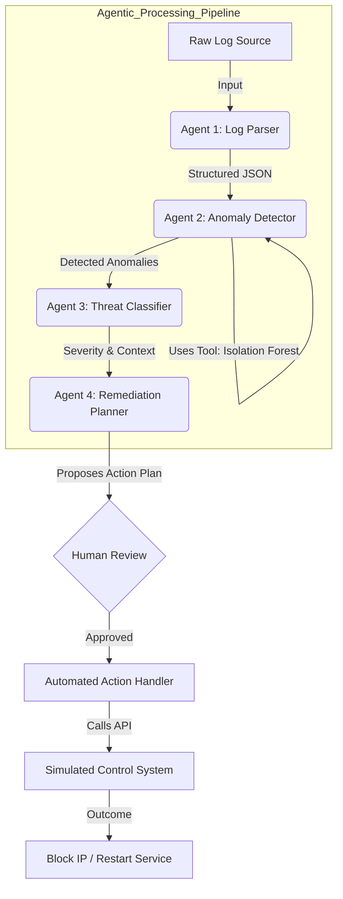

# Log Guardians: Agentic Abnormality Detection & Remediation

[](https://kaggle.com)
[](https://kaggle.com)
[](https://www.google.com/search?q=)
[](https://www.google.com/search?q=)

> **Capstone Project Submission** for the 5-Day AI Agents Intensive Course with Google.

## 📋 Project Overview

**Log Guardians** is an intelligent, multi-agent framework designed to automate Level 1 Security Operations Center (SOC) tasks. [cite\_start]By leveraging the **Google Gen AI SDK**, this system moves beyond static rule-based monitoring to a reasoning-driven workflow[cite: 14].

[cite\_start]The system ingests raw endpoint logs, identifies anomalies using a hybrid of LLM reasoning and statistical tools, classifies threats, and proposes remediation plans that require human-in-the-loop approval before execution [cite: 16, 74-78].

### 🎯 Selected Track: Enterprise Agents

  * **The Problem:** Modern infrastructure generates vast streams of unstructured logs. [cite\_start]Manual analysis is slow, rigid, and prone to missing subtle anomalies[cite: 11, 14].
  * [cite\_start]**The Solution:** A collaborative agent workforce that autonomously parses, detects, and plans remediation, reducing the cognitive load on security analysts[cite: 10].

-----

## 🧠 Key Concepts Applied

*Per the course requirements, this project demonstrates the following key concepts:*

### 1\. Multi-Agent System (Sequential Workflow)

[cite\_start]We implemented the "Agentic Processing Pipeline" defined in our design document[cite: 44]. The system uses **Gemini 1.5 Flash** to power four distinct agents:

  * [cite\_start]**Log Parser Agent:** Converts raw text to structured JSON[cite: 45].
  * [cite\_start]**Anomaly Detector Agent:** Analyzes data against baselines[cite: 49].
  * [cite\_start]**Threat Classifier Agent:** Assesses severity and correlates events[cite: 54].
  * [cite\_start]**Remediation Planner Agent:** Generates actionable steps[cite: 56].

### 2\. Tools (Code Execution & Custom Tools)

To ensure accuracy, the agents rely on tools rather than pure hallucination:

  * [cite\_start]**Code Execution (Built-in):** The *Anomaly Detector* uses a Python execution sandbox to run the **Isolation Forest** algorithm on the parsed data for statistical outlier detection[cite: 53].
  * [cite\_start]**Simulated Control API (Custom Tool):** The *Executor* uses a custom tool to interact with a mock infrastructure API (e.g., `block_ip(ip_address)`, `restart_service(service_name)`)[cite: 174].

### 3\. Human-in-the-Loop (HITL)

Security actions are critical. [cite\_start]We implemented a "pause and resume" pattern where the **Remediation Planner** submits a plan, and the system halts execution until a human operator approves the action via the interface[cite: 16, 61].

-----

## 🏗️ Architecture & Workflow

[cite\_start]The architecture follows a clear separation of concerns, processing data from ingestion to remediation[cite: 37].



### Agent Roles

1.  [cite\_start]**Log Parser:** "Ingests raw logs and structures them to JSON." [cite: 45]
2.  [cite\_start]**Anomaly Detector:** "Compares to baseline and performs semantic analysis." [cite: 49]
3.  [cite\_start]**Threat Classifier:** "Assesses severity and correlates events." [cite: 54]
4.  [cite\_start]**Remediation Planner:** "Generates action plan and creates recommendations." [cite: 56]

-----

## 🚀 Usage & Installation

### Prerequisites

  * Python 3.10+
  * Google Cloud Project with Vertex AI enabled (or Google AI Studio API Key)

### Setup

1.  **Clone the repository:**

    ```bash
    git clone https://github.com/yourusername/log-guardians.git
    cd log-guardians
    ```

2.  **Install dependencies:**

    ```bash
    pip install -r requirements.txt
    # Includes google-genai, pandas, scikit-learn
    ```

3.  **Environment Configuration:**
    Create a `.env` file:

    ```env
    GOOGLE_API_KEY=your_key_here
    MODEL_ID=gemini-1.5-flash
    ```

4.  **Run the Simulation:**

    ```bash
    python main.py --log_file data/simulated_attack.log
    ```

### Demo Output

```text
> [System] Starting Log Guardians Pipeline...
> [Agent 1] Parsing log... Done. { "timestamp": "2025-11-19...", "ip": "192.168.1.5", "action": "FAILED_LOGIN" }
> [Agent 2] Tool Call: Running Isolation Forest on batch... 
> [Agent 2] Result: Anomaly Detected (Score: -0.85).
> [Agent 3] Classification: HIGH SEVERITY. Pattern matches Brute Force Attack.
> [Agent 4] Remediation Plan Proposed:
     1. Block IP 192.168.1.5 at Firewall.
     2. Reset credentials for user 'admin'.
> [Human-in-the-Loop] Do you approve this action? (y/n): y
> [System] Executing: block_ip('192.168.1.5')... SUCCESS.
```

-----

## 📂 File Structure

```text
log-guardians/
├── data/
[cite_start]│   ├── simulated_logs.txt    # [cite: 146] "Collect publicly available and simulated logs"
│   └── baseline_data.csv     
├── src/
│   ├── agents.py             # Google Gen AI SDK Agent definitions
│   ├── tools.py              # Isolation Forest & Mock API tools
│   └── workflow.py           # Orchestration logic
├── main.py
├── requirements.txt
└── README.md
```

-----

## 🔮 Roadmap

[cite\_start]This submission covers Phases 1, 2, and 3 of our design document [cite: 109-111].

  * **Current State:** CLI-based Agentic Workflow with simulated data.
  * **Next Steps (Post-Hackathon):**
      * [cite\_start]**Phase 4:** Backend Integration with FastAPI Middleware[cite: 112].
      * [cite\_start]**Phase 5:** Frontend Development (React + MUI) for the dashboard[cite: 113].
      * [cite\_start]**Phase 6:** Cloud Deployment to Azure Kubernetes Service (AKS)[cite: 114].

-----

## 👥 Team & Acknowledgments

  * **Team:** Log Guardians
  * **Course:** Google 5-Day AI Agents Intensive
  * [cite\_start]**Reference:** Architecture based on "LLM-Agentic System for Abnormality Detection and Remediation in Endpoint Logs"[cite: 1].